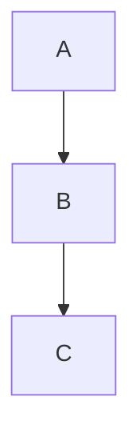
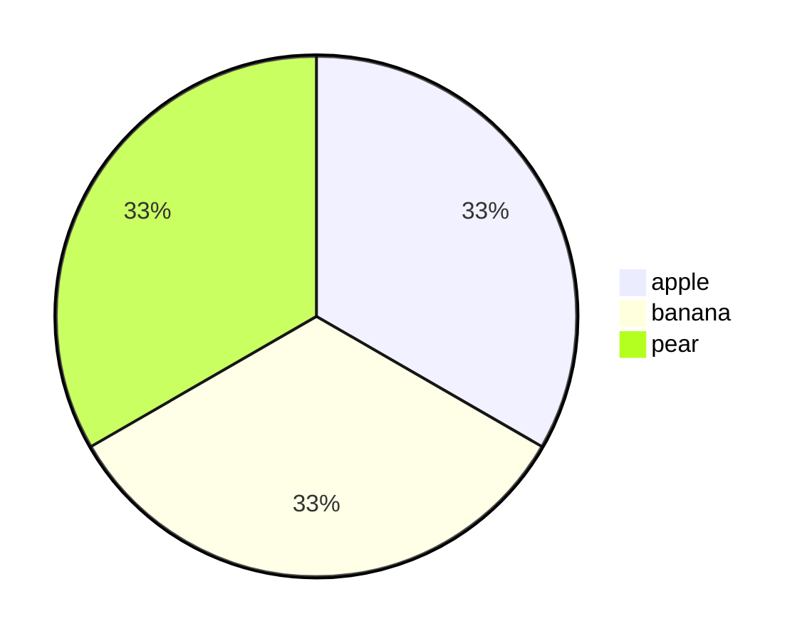

## Mermaid Diagrams in Markdown

### Description

`Mermaid` is a diagramming tool with an easy-to-use syntax for building quick, visual-rich flowcharts. It can also be used to generate data visualizations.

### Usage

- Within Markdown Preview Enhanced, you can set up a `mermaid` diagram using the following block below:

- Example: Flow Chart

#### Properties

- `visual_type`:

  - `graph`
  - `pie`

- `direction`:

  - `LR`
  - `TB`

- `nodes` and `edges`:
  - Mention a specific node.
  - Mention an edge that connects two nodes (-->)
  - End the line with a `;`

### Examples

#### Pie Chart

#### GANTT Chart

```mermaid
gantt
    title Data Engineering Project
    dateFormat  X
    axisFormat %s

    section Development
    40   : 0, 40
    section Design
    40   : 0, 40
    section Deployment
    20   : 0, 20
```

### Resources

- [Markdown Preview Enhanced Documentation](https://shd101wyy.github.io/markdown-preview-enhanced/#/diagrams)

- [Mermaid.js GitHub](https://github.com/mermaid-js/mermaid)
